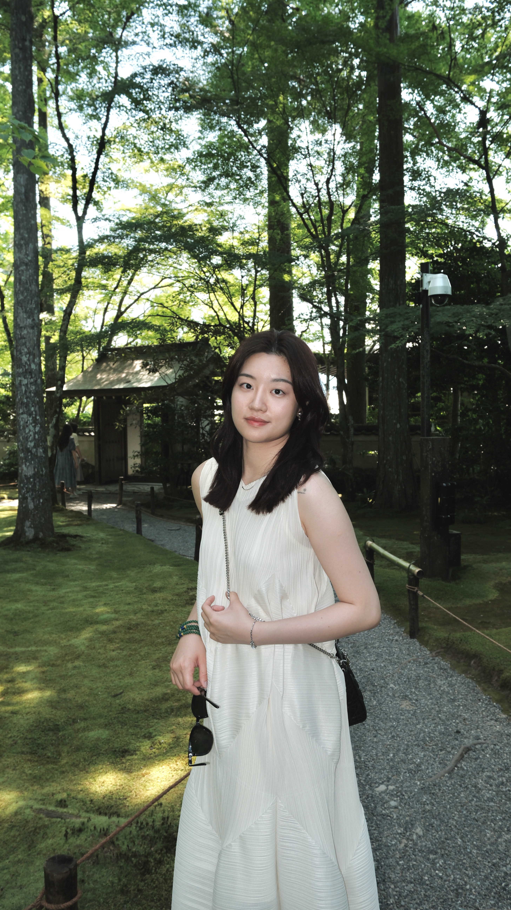

### This is My awesome website

Hi, My name is Yuyue Ma, and I go by Karol. I’m currently pursuing a Master’s in Epidemiology at Columbia University, after earning my bachelor’s degree in Cell and Molecular Biology from UC San Diego. I bring a unique interdisciplinary background combining scientific research and financial analysis. Professionally, I’ve worked across equity research, investment banking, and private equity, with a focus on healthcare and biopharma. My experience ranges from valuing innovative drug pipelines and conducting due diligence to supporting market and risk analysis. I’m analytical, detail-oriented, and proactive in problem-solving, with strong data, modeling, and communication skills.

Here is a picture of me:

Check out this page to see my [resume](about.html).

